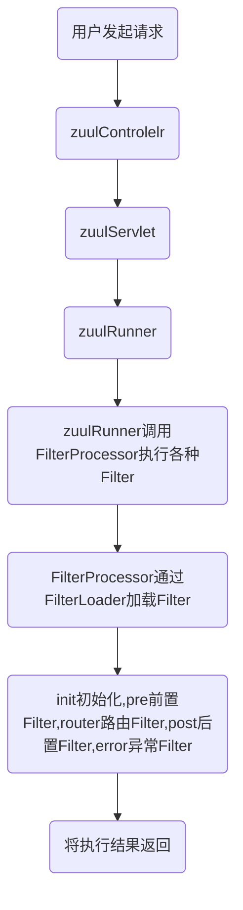

graph TD
a(用户发起请求)-->b(zuulControlelr)
b-->c(zuulServlet)
c-->d(zuulRunner)
d-->e(zuulRunner调用FilterProcessor执行各种Filter)
e-->f(FilterProcessor通过FilterLoader加载Filter)
f-->g(init初始化,pre前置Filter,router路由Filter,post后置Filter,error异常Filter)
g-->h(将执行结果返回)





## 当你的浏览器中地址栏输入并回车的一瞬间到页面能够展示回来，经历了什么?

## 网站是如何访问的?

1. 输入一个域名
2. 检查本机下C:\Windows\System32\drivers\etc\hosts配置文件下有没有这个域名映射
   1. 有直接返回对应的ip地址，这个地址中，有我们需要访问的web程序，可以直接访问(127.0.0.1 “域名”)
   2. 没有就去DNS服务器找，找到就返回，找不着就返回找不到


## 构造器Constructor是否可被override?

Constructor不能被继承，所以Constructor也就不能被override。每一个类必须有自己的构造函数，负责构造自己这部分的构造。子类不会覆盖父类的构造函数，相反必须负责在一开始调用父类的构造函数。

Java在构造实例时的顺序是这样的：

1、分配对象空间，并将对象中成员初始化为0或者空，java不允许用户操纵一个不定值的对象。

2、执行属性值的显式初始化 　　

3、执行构造器 　　

4 、将变量关联到堆中的对象上

而执行构造器的步骤有可以分为以下几步：

1、Bind构造器的参数

2、如果显式的调用了this，那就递归调用this构造器然后跳到步骤5

3、递归调用显式或者隐式的父类构造器，除了Object以外，因为它没有父类

4、执行显式的实例变量初始化（也就是上边的流程中的第二步，调用返回以后执行，

这个步骤相当于在父构造器执行后隐含执行的，看样子像一个特殊处理）

三、构造器不可被orerride（why）

其实你只需要记住一句话：构造器不是方法，那么用来修饰方法特性的所有修饰符都不能用来修饰构造器（并不等与构造器具备这些特性，虽然不能用static修饰构造器，但它却有静态特性）构造器只能用 public private protected这三个权限修饰符，且不能有返回语句。


## 重载和重写的区别

**重载**： 发生在同一个类中，方法名必须相同，参数类型不同、个数不同、顺序不同，方法返回值和访问修饰符可以不同

**重写**： 发生在父子类中，方法名、参数列表必须相同，返回值范围小于等于父类，抛出的异常范围小于等于父类，访问修饰符范围大于等于父类；如果父类方法访问修饰符为 private 则子类就不能重写该方法


## String 为什么是不可变的?StringBuffer、StringBuilder为什么是可变的？


String类中有一个char数组，并且这个char数组是被final修饰的。因为数组一旦创建长度不可变。并且被final修饰的引用一旦指向某个对象之后，不可在指向其它对象，所以String是不可变的。    StringBuffer、StringBuilder内部实际上是一个char[ ]数组，这个char[ ]数组没有被final修饰，StringBuffer和StringBulider的初始化容量应该为16，当存满之后会进行扩容，底层调用了数组拷贝的方法：System.arraycopy()…扩容的，所以StringBuffer/StringBuilder适用于字符串的频繁拼接操作，并且StringBuffer是线程安全的，StringBuilder是非线程安全的。


## String、StringBuffer 和 StringBuilder 的区别是什么?
**可变性：**String类中使用字符数组保存字符串，`private final char value[]`，所以string对象是不可变的。
StringBuilder与StringBuffer都继承**AbstractStringBuilder**类，在AbstractStringBuilder中也是使用字符数组保存字符串，`char[] value`，所以这两种对象都是可变的。

**线程安全性：** String中的对象是不可变的，也就可以理解为常量，所以线程安全；
**AbstractStringBuilder是StringBuilder与StringBuffer的公共父类**，定义了一些字符串的基本操作，如expandCapacity、append、insert、indexOf等公共方法。
StringBuffer对方法加了同步锁或者**对调用的方法加了同步锁**，所以是线程安全的。StringBuilder并没有对方法进行加同步锁，所以是非线程安全的。

**性能**：每次对String类型进行改变的时候，都会生成一个新的String对象，然后将指针指向新的String对象。StringBuffer每次都会对StringBuffer对象本身进行操作，而不是生成新的对象并改变对象引用。相同情况下使用StirngBuilder相比使用StringBuffer仅能获得10%~15%左右的性能提升，但却要冒多线程的不安全。
总结：**如果数据较少的情况下：多线程和单线程都可以使用String对象；但数据较多时，单线程操作字符串缓冲区使用StringBuilder，多线程操作字符串缓冲区使用StringBuffer。**


## 自动装箱与拆箱
**自动装箱**就是自动将基本数据类型转化为包装器类型；
**自动拆箱**就是自动将包装器类型转化为基本数据类型。

## 接口和抽象类的区别是什么？

**相同点：**

1、都可以定义属性和方法

2、都是特殊的类，都需要子类来操作具体的逻辑

3、都没有抽象方法

4、都不能创建对象

5、都可以利用多态操作数据

6、子类必须实现里面的抽象方法

7、java1.8以后，都可以拥有带方法体的方法

**不同点：**

1、接口**可以被子类实现**，但是抽象类由于java本身的特性**只能单继承**；

2、抽象类的方法，可以用protect**修饰**，接口只能是public 

3、抽象类可以拥有自己的**构造**，接口不能拥有

4、接口之间可以被**多继承**，抽象类只能**单继承**

5、java1.8以后接口可以拥有**default修饰的方法体**，还有**stastic静态方法体**，**抽象类没有**

**总结：**

抽象类和接口**两者都不能被实例化**，<u>接口就是抽象类的一种特殊情况</u>。


## 构造方法有哪些特性？

1.名字与类名**相同**。

2.**没有返回值，但不能用 void 声明构造函数**。

3.**生成类的对象时自动执行**，无需调用。

## 1在调用子类构造方法之前会先调用父类没有参数的构造方法,其目的是?

帮助子类做初始化工作

## == 与 equals区别

==号在比较基本数据类型时比较的是值，而用==号比较两个对象时比较的是两个对象的地址值； 

equals()方法存在于 Object 类中，默认效果和==号的效果一样，也是比较的地址值，然而，Java 提供的所有类中， 绝大多数类都重写了 equals()方法，比如 string，integer 等，重写后的 equals()方法一般都是比较两个对象的值 。 

## 你重写过 hashcode 和 equals 么，为什么重写 equals 时必须重写 hashCode 方法？
1. 使用hashcode方法**提前校验**，可以**避免**每一次比对都**调用equals方法**，提高效率
2. **保证是同一个对象**，如果重写了equals方法，而没有重写hashcode方法，**会出现equals相等的对象，hashcode不相等的情况**，重写hashcode方法就是为了避免这种情况的出现。

## 线程有哪些基本状态,并描述每种状态?
1. **初始(NEW)**：新创建了一个线程对象，但还没有调用start()方法。
2. **运行(RUNNABLE)**：Java线程中将就绪（ready）和运行中（running）两种状态笼统的称为“运行”。线程对象创建后，其他线程(比如main线程）调用了该对象的start()方法。该状态的线程位于可运行线程池中，等待被线程调度选中，获取CPU的使用权，此时处于就绪状态（ready）。就绪状态的线程在获得CPU时间片后变为运行中状态（running）。
3. **阻塞(BLOCKED)**：表示线程阻塞于锁。
4. **等待(WAITING)**：进入该状态的线程需要等待其他线程做出一些特定动作（通知或中断）。
5. **超时等待(TIMED_WAITING)**：该状态不同于WAITING，它可以在指定的时间后自行返回。
6. **终止(TERMINATED)**：表示该线程已经执行完毕。

## final 关键字修饰这三个地方：变量、方法、类，会有什么作用
1. **final修饰类**
 **final类不能被继承**，因此final类的成员方法没有机会被覆盖，默认都是final的。在设计类时候，如果这个类不需要有子类，**类的实现细节不允许改变**，并且确信这个**类不会载被扩展**，那么就设计为final类。
2. **final修饰方法**
如果一个类不允许其子类覆盖某个方法（即**不允许被子类重写**），则可以把这个方法声明为final方法。使用final方法的原因有二：把方法锁定，防止任何继承类修改它的意义和实现。高效。编译器在遇到调用final方法时候会转入内嵌机制，大大提高执行效率。
3. **final修饰变量(常量)**
用final修饰的成员变量表示常量，**值一旦给定就无法改变**！final修饰的变量有三种：**静态变量、实例变量和局部变量**，分别表示三种类型的常量。一旦给final变量初值后，值就不能再改变了。另外，final变量定义的时候，可以**先声明，而不给初值**，这种变量也称为final空白，无论什么情况，编译器都确保空白final**在使用之前必须被初始化**。但是，final空白在final关键字final的使用上提供了更大的灵活性，为此，一个类中的final数据成员就可以实现依对象而有所不同，却有保持其恒定不变的特征。

## Java 序列化中如果有些字段不想进行序列化，怎么办？
对于不想进行序列化的变量，使用**transient关键字修饰**。
transient关键字的作用是：阻止实例中那些用此关键字修饰的的变量序列化；当对象被反序列化时，被transient修饰的变量值不会被持久化和恢复。**transient只能修饰变量，不能修饰类和方法。**

## 获取用键盘输入常用的两种方法
```java
Scanner input = new Scanner(System.in);
String s  = input.nextLine();
input.close();
```

```java
BufferedReader input = new BufferedReader(new InputStreamReader(System.in));
String s = input.readLine();
```

## 既然有了字节流,为什么还要有字符流?
因为字节流转换成字符流，过程很耗时。如果你必须要使用字符流，但你只得到了字节流，就要经历这个转换，其中编码也容易出问题。所以就直接把字符流单独作为了一个部分，从而提高使用字符流的效率。

## 描述深拷贝和浅拷贝

**浅拷贝：**被复制对象的所有变量都含有与原来的对象相同的值，而所有的对其他对象的引用仍然指向原来的对象。换言之，**浅拷贝仅仅复制所考虑的对象，而不复制它所引用的对象**。
**深拷贝：**被复制对象的所有变量都含有与原来的对象相同的值.而那些引用其他对象的变量将指向被复制过的新对象.而不再是原有的那些被引用的对象。换言之，**深拷贝把要复制的对象所引用的对象都复制了一遍**


## 说说&和&&的区别。
 &和&&都可以用作逻辑与的运算符，表示逻辑与（and），当运算符两边的表达式的结果都为true时，整个运算结果才为true，否则，只要有一方为false，则结果为false。
&&还具有短路的功能，即如果第一个表达式为false，则不再计算第二个表达式

## final, finally, finalize的区别。
1. 如果一个类被声明为final，意味着它不能再派生出新的子类，不能作为父类被继承。因此一个类不能既被声明为 abstract的，又被声明为final的。将变量或方法声明为final，可以保证它们在使用中不被改变。被声明为final的变量必须在new一个对象时初始化（即只能在声明变量或构造器或代码块内初始化），而在以后的引用中只能读取，不可修改。被声明为final的方法也同样只能使用，不能覆盖(重写)。
2. finalize()方法在Object中进行了定义，用于在对象“消失”时，由JVM进行调用用于对对象进行垃圾回收。
3. finally为区块标志，用于try语句中，表示必须运行的区块部分

## ArrayList和Vector的区别
[](https://imgtu.com/i/bpTeKI)

## ArrayList的扩容机制

ArrayList每次添加元素时都会**检查是否需要扩容**：ArrayList一次添加元素时，赋予ArrayList默认容量10，再往里面添加元素，添加元素前先检查当前元素个数是否已经**达到容量上限**，若是则先以**1.5倍*原容量上限**进行扩容再添加元素。

## HashMap和Hashtable的区别

**1、两者父类不同**
**HashMap**是继承自**AbstractMap**类，而**Hashtable**是继承自**Dictionary**类。不过它们都实现了同时实现了map、Cloneable（可复制）、Serializable（可序列化）这三个接口。
**2、对外提供的接口不同**
Hashtable比HashMap多提供了elments() 和contains() 两个方法。
elments() 方法继承自Hashtable的父类Dictionnary。elements() 方法用于返回此Hashtable中的value的枚举。
contains()方法判断该Hashtable是否包含传入的value。它的作用与containsValue()一致。事实上，contansValue() 就只是调用了一下contains() 方法。
**3、对null的支持不同**
Hashtable：**key和value都不能为null**。
HashMap：**key可以为null，但是这样的key只能有一个**，因为必须保证key的唯一性；可以有多个key值对应的value为null。
**4、安全性不同**
**HashMap是线程不安全的**，在多线程并发的环境下，可能会产生死锁等问题，因此需要开发人员自己处理多线程的安全问题。
**Hashtable是线程安全的**，它的每个方法上都有synchronized 关键字，因此可直接用于多线程中。
虽然HashMap是线程不安全的，但是它的效率远远高于Hashtable，这样设计是合理的，因为大部分的使用场景都是单线程。当需要多线程操作的时候可以使用**线程安全**的**ConcurrentHashMap**。
ConcurrentHashMap虽然也是线程安全的，但是它的效率比Hashtable要高好多倍。因为ConcurrentHashMap使用了分段锁，并不对整个数据进行锁定。
**5、初始容量大小和每次扩充容量大小不同**
**6、计算hash值的方法不同**

## 说说List,Set,Map三者的区别？

**List(对付顺序的好帮手)：**
List接口存储一组不唯一（可以有多个元素引用相同的对象），有序的对象

**Set(注重独一无二的性质):**
不允许重复的集合。不会有多个元素引用相同的对象。

**Map(用Key来搜索的专家):**
使用键值对存储。Map会维护与Key有关联的值。两个Key可以引用相
同的对象，但Key不能重复，典型的Key是String类型，但也可以是任何对象。

## 什么是线程死锁?如何避免线程死锁?

死锁是指两个或两个以上的进程在执行过程中，由于竞争资源或者由于彼此通信而造成的一种阻塞的现象，若无外力作用，它们都将无法推进下去。此时称系统处于死锁状态或系统产生了死锁，这些永远在互相等待的进程称为死锁进程。

1、尽量使用 tryLock的方法，设置超时时间，超时可以退出防止死锁。 

2、尽量使用 Java.util.concurrent 并发类代替自己手写锁。 

3、尽量降低锁的使用粒度，尽量不要几个功能用同一把锁。 

4、尽量减少同步的代码块。 

## 产生死锁的四个必要条件

**互斥条件：**进程要求对所分配的资源（如打印机）进行排他性控制，即在一段时间内某资源仅为一个进程所占有。此时若有其他进程请求该资源，则请求进程只能等待。
**不可剥夺条件：**进程所获得的资源在未使用完毕之前，不能被其他进程强行夺走，即只能由获得该资源的进程自己来释放（只能是主动释放)。
**请求与保持条件：**进程已经保持了至少一个资源，但又提出了新的资源请求，而该资源已被其他进程占有，此时请求进程被阻塞，但对自己已获得的资源保持不放。
**循环等待条件：**

## 说说 sleep() 方法和 wait() 方法区别和共同点?


## 现在有线程 T1、T2 和 T3。你如何确保 T2 线程在 T1 之后执行，并且 T3 线程在 T2 之后执行？

可以利用[Thread类](https://so.csdn.net/so/search?q=Thread类&spm=1001.2101.3001.7020)的join方法。

## jdk1.8之后的新特性?

1：支持函数式编程 Lambda 表达式

2：方法引用

3：集合的stream处理

最大的变化是:jdk的内存结构发生重大变化永久代弃用，class信息使用本地内存，存储常量池移动到堆当中

## 反射的概念

可以通过 class 字节码文件对象，操作类的成员(构造方法，成员变量，成员方法)，动态获取类的信息以及动态调用对象的方法的功能称为 Java 语言的反射机制。 

## 反射的作用和应用场景 

可以通过配置文件来动态配置和加载类，以实现软件工程理论里所提及的类与类，模块与模块之间的解耦

## 反射获取文件对象的三种方式

1、Class.forName(类的全限定名) 

2、类名.class 

3、对象.getClass()

## 反射中的常用类

1、Class 类:反射的核心类，可以获取类的属性，方法等内容信息 

2、Constractor ：构造方法

3、Method： 成员方法

4、Field；

## 谈一下hashMap中put是如何实现的？
1、先将key和value封装到Node节点中
2、底层会调用key的hashcode()方法，通过hash函数将hash值转换为数组下标，下标位置上如果没有任何元素，就把该Node添加到该位置上（该下标处）如果该下标处对应的位置上已经存在元素或链表（多于一个元素变成链表），那么就会拿着新节点的key与链表上的每一个人节点中的key进行equals。1、 如果所有对比（equals)都返回false,那么这个新节点将会被添加到链表的尾部。（大于8个就会转换成红黑树）2、 如果其中有一个对比（equals)返回true，那么这个节点上的value将会被新节点的value覆盖。

## 谈一下HashMap的底层原理是什么？

hashmap底层是使用数组+链表+红黑树实现的

## 谈一下hashMap中什么时候需要进行扩容，扩容resize()又是如何实现的？

1.初始化数组table

2.当数组table的size达到阙值时即++size > load factor \* capacity 时，也是在putVal函数中

**实现过程：(细讲)**

1.通过判断旧数组的容量是否大于0来判断数组是否初始化过

否：进行初始化

判断是否调用无参构造器，

是:使用默认的大小和阙值

否:使用构造函数中初始化的容量，当然这个容量是经过tableSizefor计算后的2的次幂数

是，进行扩容，扩容成两倍(小于最大值的情况下)，之后在进行将元素重新进行与运算复制到新的散列表中

概括的讲：扩容需要重新分配一个新数组，新数组是老数组的2倍长，然后遍历整个老结构，把所有的元素挨个重新hash分配到新结构中去。

## 谈一下hashMap中get是如何实现的？

对key的hashCode进行hashing，与运算计算下标获取bucket位置，如果在桶的首位上就可以找到就直接返回，否则在树中找或者链表中遍历找，如果有hash冲突，则利用equals方法去遍历链表查找节点。

## 为什么不直接将key作为哈希值而是与高16位做异或运算？

因为数组位置的确定用的是与运算，仅仅最后四位有效，设计者将key的哈希值与高16为做异或运算使得在做&运算确定数组的插入位置时，此时的低位实际是高位与低位的结合，增加了随机性，减少了哈希碰撞的次数。

## 为什么是16？为什么必须是2的幂？如果输入值不是2的幂比如10会怎么样？

## 谈一下当两个对象的hashCode相等时会怎么样？
因为hashcode相同，所以它们的bucket位置相同，‘碰撞’会发生。因为HashMap使用链表存储对象，这个Entry(包含有键值对的Map.Entry对象)会存储在链表中。这个时候要理解根据hashcode来划分的数组，如果数组的坐标相同，则进入链表这个数据结构中了，一般的添加都在最前面，也就是和数组下标直接相连的地方，链表长度到达8的时候，jdk1.8上升为红黑树

## 请解释一下HashMap的参数loadFactor，它的作用是什么？
负载因子表示HashMap的拥挤程度，影响hash操作到同一个数组位置的概率。默认负载因子等于0.75，可以自定义负载因子。当HashMap里面的元素已经达到数组长度的75%时，表示HashMap太挤了，需要扩容，扩容后的数组大小是原数组的2倍
## 如果HashMap的大小超过了负载因子(load factor)定义的容量，怎么办？
超过阙值会进行扩容操作，扩容后的数组大小是原数组的2倍，将原来的元素重新哈希放入到新的散列表中去。
~~传统hashMap的缺点(为什么引入红黑树？)：~~
~~HashMap和ConcurrentHashMap的区别~~
~~平时在使用HashMap时一般使用什么类型的元素作为Key？~~
~~volatile关键字~~

## tomcat调优

1.tomcat默认的线程创建方式,是一次请求,创建一个新的线程来处理优化方案,可以配置线程池来创建和管理线程,可以设置线程数量

2.tomcat默认的连接处理方式是BIO,阻塞的IO,容易造成客户端堵塞优化方案：使用http11Nio协议来进行连接的处理

3:因为tomcat是基于jvm的,所以应该对jvm的启动参数进行调优(堆栈内存、垃圾收集器)

## get和post请求的区别

**1、url可见性：**

get，参数url可见；

post，url参数不可见

**2、数据传输上：**

get，通过拼接url进行传递参数；

post，通过body体传输参数

**3、缓存性：**

get请求是可以缓存的

post请求不可以缓存

**4、后退页面的反应**

get请求页面后退时，不产生影响

post请求页面后退时，会重新提交请求

**5、传输数据的大小**

get一般传输数据大小不超过2k-4k（根据浏览器不同，限制不一样，但相差不大）

post请求传输数据的大小根据php.ini 配置文件设定，也可以无限大。

**6、安全性**

这个也是最不好分析的，原则上post肯定要比get安全，毕竟传输参数时url不可见，但也挡不住部分人闲的没事在那抓包玩。安全性个人觉得是没多大区别的，防君子不防小人就是这个道理。对传递的参数进行加密，其实都一样。

## 转发(Forward)和重定向(Redirect)的区别

**地址栏**
转发：不变，不会显示出转向的地址
重定向：会显示转向之后的地址

**请求**
重定向：至少提交了两次请求

**数据**
转发：对request对象的信息不会丢失，因此可以在多个页面交互过程中实现请求数据的共享
重定向：request信息将丢失

**原理**
转发：是在服务器内部控制权的转移，是由服务器区请求，客户端并不知道是怎样转移的，因此客户端浏览器的地址不会显示出转向的地址。
重定向：是服务器告诉了客户端要转向哪个地址，客户端再自己去请求转向的地址，因此会显示转向后的地址，也可以理解浏览器至少进行了两次的访问请求。


## JSP 九大内置对象 

request：负责得到客户端请求的信息，对应类型：javax.servlet.http.HttpServletRequest

response:负责向客户端发出响应，对应类型：javax.servlet.http.HttpServletResponse

session:负责保存同一客户端一次会话过程中的一些信息，对应类型：javax.servlet.http.httpsession 

out：负责管理对客户端的输出，对应类型：javax.serlvet.jsp.jspwriter

application:表示整个应用环境的信息，对应类型：javax.servlet.servletcontext

config:表示 ServletConfig，对应类型：javax.servlet.servletconfig 

exception:表示页面中发生的异常，可以通过它获得页面异常信息，对应类型：java.lang.exception 

pagecontext:表示这个 JSP 页面上下文，对应类型：javax.servlet.jsp.pagecontext 

page:表示当前 JSP 页面本身。

## JSP和Servlet是什么关系

Cookie和Session的的区别
JDBC访问数据库的基本步骤是什么？
说说preparedStatement和Statement的区别
数据库连接池的原理。为什么要使用连接池。

## 什么是事务

事务是对数据库中一系列操作进行统一的回滚或者提交的操作，主要用来保证数据的完整性和一致性。

## 数据库事务的四个特性

**原子性：**一个事物是应用中不可再分的最小执行体，它们应该是一个整体，要么全部成功，要么全部失败。
**一致性：**一个事务的执行是从一个一致性状态，变为另一个一致性状态。
**隔离性：**一个执行的事务，不能被其他事务所干扰
**持久性：**事务一旦提交，对数据的任何改变应该是永久性的，即使其他操作或故障都不能进行干扰。

## drop,delete与truncate的区别

**drop：**drop table 表名

   删除内容和定义，并释放空间。执行drop语句，将使此表的结构一起删除。

**truncate (清空表中的数据)：**truncate table 表名

​    删除内容、释放空间但不删除定义(也就是保留表的数据结构)。与drop不同的是,只是清空表数据而已。

​    truncate不能删除行数据，虽然只删除数据，但是比delete彻底，它只删除表数据。

**delete：**delete from 表名 （where 列名 = 值）

​    与truncate类似，delete也只删除内容、释放空间但不删除定义；但是delete即可以对行数据进行删除，也可以对整表数据进行删除。
## sql 怎么调优,索引命中怎么知晓？（重点）
使用 explain 关键字查看 sql 的执行计划,可以看到该 sql 的索引命中情况、索引命中类型、命中率等相关的信息,通过这种方式可以对 sql 语句进行调优,对关键查询的条件创建索引以及注意一下 sql 语句的用法尽量不使用 like,尽量避免在某一列上进行运算不使用 in not in 使用
exist not exist 等等代替


## 什么是 Mybatis 

Mybatis 是一个半 ORM（对象关系映射）框架，它内部封装了 JDBC，开发时只需要关注 SQL 语句本身，不需要花费精力去处理加载驱动、创建连接、创建 statement 等繁杂的过程。程序员直接编写原生态 sql，可以严格控制 sql 执行性能，灵活度高

## mybatis的优缺点

Mybaits 的优点： 

**基于 SQL 语句编程，相当灵活**，不会对应用程序或者数据库的现有设计造成任何影响，SQL 写在 XML 里，**解除 sql 与程序代码的耦合**，便于统一管理；提供 XML 标签，**支持编写动态 SQL 语句**，并可重用。 

MyBatis 框架的缺点： 

SQL 语句的编写工作量较大，尤其当字段多、关联表多时，对开发人员编写 SQL 语句的功底有一定要求。

## 在MyBatis中,#{}和${}的区别是什么？

1. \#{}是**占位符**预编译处理，${}是**连接符**字符串替换。
2. Mybatis在处理#{}时，会将sql中的#{}替换为?号，调用PreparedStatement的set方法来赋值；
3. Mybatis在处理$ {}时，就是把${}替换成变量的值。
4. 使用#{}可以有效的防止SQL注入，提高系统安全性。

## mybatis分页如何处理

mybatis 分页查询有两种方案： 

1、可以通过 **limit 关键字拼接 sql 语句**，需要两个参数，第一个参数开始条数，第二个参数查询个数； 

2、可以通过 **pageHelper 插件**实现

## 框架是什么东西

框架是一组抽象封装的设计,是一种软件半成品,程序员必须得遵守框架的api,配置配置文件和遵循代码规范,极高的提高了开发效率

## Mybatis是否支持延迟加载？如果支持，它的实现原理是什么？

Mybatis仅支持**association关联对象**和**collection关联集合对象**的延迟加载，association指的就是**一对一**，collection指的就是**一对多**查询。

在Mybatis配置文件中，可以配置是否启用延迟加载`lazyLoadingEnabled=true/false`。

它的原理是，使用CGLIB创建目标对象的代理对象，当调用目标方法时，进入拦截器方法，

比如调用a.getB().getName()，
拦截器invoke()方法发现a.getB()是null值，
那么就会单独发送事先保存好的查询
关联B对象的sql，把B查询上来，然后调用a.setB(b)，
于是a的对象b属性就有值了，
接着完成a.getB().getName()方法的调用。
这就是延迟加载的基本原理。

## 简单的说一下MyBatis 的一级缓存和二级缓存

Mybatis 首先去缓存中查询结果集，如果没有则查询数据库，如果有则从缓存取出返回结果集就不走数据库。

Mybatis 的二级缓存即查询缓存，它的**作用域**是一个 **mapper 的 namespace**，即在同一个 namespace 中查询 sql 可以从缓存中获取数据。二级缓存是可以跨 SqlSession 的。

## Mybatis中如何执行批处理？

需要在全局配置文件或获取sqlSession时设置执行类型为`BATCH`

## mybatis 的 mapper 代理底层怎么实现?
 mybatis 是先通过 xml 解析,反射,最后通过动态代理机制来生成 mapper 接口的实现类对象
namespace 的值等于 mapper 接口的类路径、sql 标签的 id 值等于 mapper 接口的方法名,生成的
Mapper 代理对象的命名为接口的首字母小写。

## 查询语句不同元素（where、jion、limit、group by、having等等）执行先后顺序?

from、join、where、group by、having、select distinct、order by、limit…


## 数据库调优（重点）

数据库结构优化设计数据库的时候,要预估单表的峰值,因为以Mysql为例,当单表的数据超过千万条,查询速度就特别缓慢了,这里就需要对数据库进行分库分表（数据分片）,为了提高查询和写入性能,mysql可以采取主从结构主数据库采用innodb引擎,从数据库采用myIsam引擎,主从之间通过监听主数据库的binlog日志来完成数据一致。

从服务器有两个线程，一个是IO线程，一个是sql线程，IO线程负责读取主mysql服务器的binlog日志，把读取到的日志放入到中继日志中，sql线程负责读取中继日志，并转成具体的操作，实现数据的一致性。

SQL优化,本质是通过创建索引,使用explain关键字,查询索引命中情况,对sql进行调优

使用缓存层,预先对经常常用的数据库数据进行缓存,减少数据库的压力提高数据库性能


## spring 的优点 

spring 属于低侵入式设计，代码的污染极低； 

spring 的 DI 机制将对象之间的依赖关系交由框架处理，减低组件的耦合性； 

Spring 提供了 AOP 技术，支持将一些通用任务，如安全、事务、日志、权限等进行集中式管理，从而提供更好的复用。 

spring 对于主流的应用框架提供了集成支持。

## Spring的核心

IOC、AOP

## Spring 管理事务的方式有几种？

spring支持**编程式事务管理**和**声明式事务管理**两种方式。

## Spring AOP是什么？

即**面向切面编程**，它将业务逻辑的各个部分进行隔离，使开发人员在编写业务逻辑时可以专心于核心业务，从而提高了开发效率。

## Spring AOP中有哪些不同的通知类型?

前置通知、环绕通知、后置通知、异常通知、最终通知

## Spring AOP的底层是怎样实现的？

1、JDK动态代理

2、CGLIB代理

## Spring AOP 默认使用jdk动态代理还是cglib？

jdk动态代理

## SpringAOP的应用场景

1、日志记录

2、权限验证

3、效率检查（个人在代码上，喜欢用注解+切面，实现校验，redis分布式锁等功能）

4、事务管理（spring 的事务就是用AOP实现的）

## Spring中的常用注解(最少写10个)

## SpringMVC常用注解(最少写5个以上)

@Controller、@RequestMapping、@Params、@Autowired、@Resource


事务的隔离级别 

读未提及（READ_UNCOMMITTED）

读未提及，该隔离级别允许脏读取，其隔离级别是最低的。换句话说，如果一个事务正在处理某一数据，并对其进行了更新，但同时尚未完成事务，因此还没有提交事务；而以此同时，允许另一个事务也能够访问该数据。

读已提交（READ_COMMITTED）

读已提交是不同的时候执行的时候只能获取到已经提交的数据。 

这样就不会出现上面的脏读的情况了。 

可重复读（REPEATABLE_READ）

可重复读就是保证在事务处理过程中，多次读取同一个数据时，该数据的值和事务开始时刻是一致的。因此该事务级别禁止了不可重复读取和脏读，但是有可能出现幻读的数据。

串行化（SERIALIZABLE）

顺序读是最严格的事务隔离级别。它要求所有的事务排队顺序执行，即事务只能一个接一个地处理，不能并发。 


## spring 中 bean 的作用域

scope 配置项有 5 个属性，用于描述不同的作用域。 

1. singleton(单例) 使用该属性定义 Bean 时，IOC 容器仅创建一个 Bean 实例，IOC 容器每次返回的是同一个 Bean 实例。 
2. prototype（多例） 使用该属性定义 Bean 时，IOC 容器可以创建多个 Bean 实例，每次返回的都是一个新的实例。
3. request 该属性仅对 HTTP 请求产生作用，使用该属性定义 Bean 时，每次 HTTP 请求都会创建一个新的 Bean，适用于WebApplicationContext 环境。 
4. session 该属性仅用于 HTTP Session，同一个 Session 共享一个 Bean 实例。不同 Session 使用不同的实例。 
5. global-session 该属性仅用于 HTTP Session，同 session 作用域不同的是，所有的 Session 共享一个 Bean 实例。

## Spring 的 IOC 原理

IOC 就是控制反转，原来我们需要创建对象的，必须自己 new，但是现在有了 spring 容器，我们不需要再自己 new了，有两个好处，1)解耦2)统一管理对象。 

SpringIOC，用户只需要进行配置，容器会在容器中自动实例化依赖对象，并且是单例模式，直接通过@autowired 直接注入即可。

## spring 事务传播特性 

 （1）propagation_requierd：如果当前没有事务，就新建一个事务，如果已存在一个事务中，加入到这个事务中， 

这是 Spring 默认的选择。 

（2）propagation_supports：支持当前事务，如果没有当前事务，就以非事务方法执行。 

（3）propagation_mandatory：使用当前事务，如果没有当前事务，就抛出异常。

（4）propagation_required_new：新建事务，如果当前存在事务，把当前事务挂起。 

## SpringMVC的流程？

1. 用户发送请求到前端控制器DispatcherServlet
2. DispatcherServlet收到请求调用处理器映射器 HandlerMapping
3. HandlerMapping找到具体的处理器（通过xml 或者注解配置）最终能生成处理器对象以及处理器拦截器（如果有的情况下），一起返回给DispatcherServlet
4. DispatcherServlet调用HandlerAdapter（处理器适配器）
5. HandlerAdapter经过适配调用具体的处理器的某个方法（Handler/Controller）
6. Controller执行完成返回ModelAndView对象
7. HandlerAdapter将Controller返回的ModelAndView再返回给DispatcherServlet
8. DispatcherServlet将ModelAndView传给ViewReslover （视图解析器）
9. ViewReslover解析后返回具体的View（视图）
10. DispatcherServlet根据View进行渲染视图(也就是将模型数据填充到视图中)
11. DispatcherServlet响应用户

## SpringMVC怎么样设定重定向和转发的？

一般情况下,控制器方法返回字符串类型的值会被当成逻辑视图名处理。如果返回的字符串中带 forward: 或 redirect: 前缀时,SpringMVC会对他们进行特殊处理:将 forward: 和redirect: 当成指示符,其后的字符串作为 URL 来处理。

## SpringMVC如何解决POST请求中文乱码问题，GET的又如何处理呢？

**POST：**在web.xml文件中配置字符编码过滤器。

**GET：**修改tomcat配置文件、对request获取的参数重新进行编码

## SpingMVC需要接受前台JSON字符串并注入到对象中需要使用什么注解

@RequestBody

## Spring框架中用到了哪些设计模式

- 工厂模式：BeanFactory 就是简单工厂模式的体现，用来创建对象的实例； 
- 单例模式：Bean 默认为单例模式。 
- 代理模式：Spring 的 AOP 功能用到了 JDK 的动态代理和 CGLIB 字节码生成技术；
- 模板方法：用来解决代码重复的问题。比如. RestTemplate, JmsTemplate, JpaTemplate。 


## 什么是 Spring Boot？ Spring Boot特性

SpringBoot 是 Spring 开源组织下的子项目，是 Spring 组件一站式解决方案，主要是简化了使用 Spring 的难度，简省了繁重的配置，提供了各种启动器，开发者能快速上手。

**特性**

- 能够快速的创建基于Spring的应用程序
- 能够直接运行（使用main方法的方式）启动内置的tomcat运行SpringBoot 程序，不需要进行部署
- 提供约定的 starter pom 来简化maven 的配置,让maven配置更加简单
- SpringBoot添加一个依赖 自动配置其相关联的配置
- SpringBoot 提供健康检查机制
- 基本可以完全不使用xml配置文件，采用注解进行配置

## Spring Boot的四大核心

**自动配置**
     针对于spring应用和常见的功能，SpringBoot提供了自动相关配置

**起步依赖**
    你告诉SpringBoot 你需要什么功能,它就能够引入需要的依赖库

**Actuator**
    帮助我们了解SpringBoot内部信息

**命令行界面**
     Spring Boot 可选择的特性  了解即可

## Spring Boot的优点？

**独立运行**

Spring Boot而且内嵌了各种servlet容器，Tomcat、Jetty等，现在不再需要打成war包部署到容器中，Spring Boot只要打成一个可执行的jar包就能独立运行，所有的依赖包都在一个jar包内。

**简化配置**

spring-boot-starter-web启动器自动依赖其他组件，减少了maven的配置。

**自动配置**

Spring Boot能根据当前类路径下的类、jar包来自动配置bean，如添加一个spring-boot-starter-web启动器就能拥有web的功能，无需其他配置。

**无代码生成和XML配置**

Spring Boot配置过程中无代码生成，也无需XML配置文件就能完成所有配置工作，这一切都是借助于条件注解完成的，这也是Spring4.x的核心功能之一。

**应用监控**

Spring Boot提供一系列端点可以监控服务及应用，做健康检测。

## SpringBoot自动装配原理

 1. `SpringApplication.run(Application.class, args);` 执行流程中有 `refreshContext(context)` 这句话

 2. `refreshContext(context)`内部会对我们配置类上面的标签进行解析( `@SpringBootApplication`)
      实现自动装配的注解 `@EnableAutoConfiguration`

 3. `@EnableAutoConfiguration` 注解里面  @Import 引入配置类 `AutoConfigurationImportSelector` 

 4. `AutoConfigurationImportSelector` 中的方法  `getCandidateConfigurations` 中 
     `SpringFactoriesLoader.loadFactoryNames(this.getSpringFactoriesLoaderFactoryClass(), this.getBeanClassLoader());`

 5. `loadFactoryNames` 的作用是 读取我们jar包中的  `META-INF/spring.factories`

 6. 该文件中配置了自动装配类

    `DruidDataSourceAutoConfigure`


## 自定义一个starter的步骤：

1. 创建一个模块
   命名规则：
   spring-boot-starter 官方的命名
   redis-spring-boot-starter 第三方命名
2. 在resources中创建 META-INF 文件夹 ，在文件夹中创建  spring.factories文件
3. spring.factories中进行如下配置
   `org.springframework.boot.autoconfigure.EnableAutoConfiguration=\com.liushao.redis.boot.MyRedisAutoConfigure`
4. 添加配置类,需要按照规则创建对象
5. 在内部根据条件创建redis对象 （操作redis）
6. 有一个类 RedisProperties 【主机地址、端口、密码】


## 常见的HTTP相应状态码（最少写5个）
200 – 请求成功

301 – 资源(网页等)被永久转移到其它

URL404 – 请求的资源(网页等)不存在

405方法不被允许

500 – 内部服务器错误

## JVM运行时数据区域有哪些?
程序计数器（线程私有）

Java虚拟机栈（线程私有）

本地方法栈（线程私有）

Java 堆（线程共享）

方法区（线程共享）

运行时常量池

## JVM运行是数据区域哪些是私有的，哪些是共享的?
程序计数器（线程私有）

Java虚拟机栈（线程私有）

本地方法栈（线程私有）

Java 堆（线程共享）

方法区（线程共享）

运行时常量池


